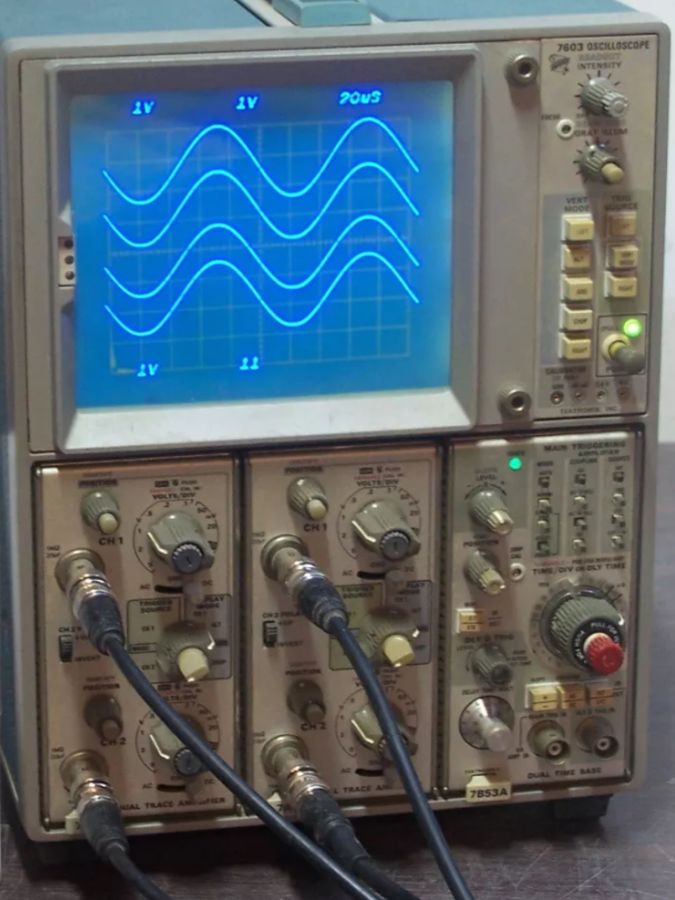
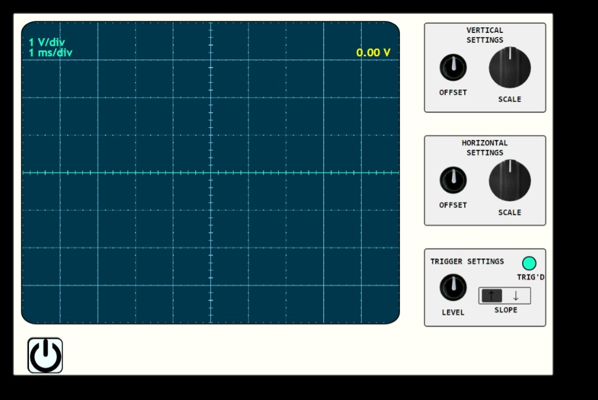

# Web Oscilloscope
## Inspired to the Tektronix 7603 scope

[Demo on Youtube](https://youtu.be/Xsd_C1Tucyw)

##




## Introduction
This web oscilloscope has been developed following the style of the Tektronix 7xxx series scopes. They were made from 1972 till 1990.
The real scope was designed to host two dual-channel vertical modules and one horizontal module, with the capability of 5 ns/div, which gave it the ability to work with signal frequencies up to 100 MHz.

The reason that lead to pick this particular model is the fact that it has been the first oscilloscope I owned. It taught me a lot about electronics thanks to its crude interface, which pushes the user to really read what's happening on the screen using the grid divisions.

The emulator is a very simplified replica of the real tool, but it has all the basic features needed to use one of its channels.

## Using the emulator
The emulator, when launched, asks the user for the permission to get audio data from the default input channel selected on the user's device. If the user declines the request by mistake, the page can be reloaded to grant the permission after getting another request.

Once the user clicks on the power button, the startup procedure begins: the backlight gets turned on, the trace appears, as does the overlay text.

When the scope is on, the knobs are unlocked.



The small ones are used to add/subtract an offset value: this means that the trace can be shifted vertically and/or horizontally. If the user needs to look at a different portion of the signal, he doesn't need to strike a balance between the wanted position and the scale used.

The bigger knobs serve the role of changing the vertical and horizontal scaling, giving full control to the user about how many volts-per-division and seconds-per-division each square of the grid represents.

The last small knob is used to select the level of the signal which has to be intercepted, technically speaking 'triggered', and the switch by its side sets the ascending/descending slope of the triggered curve.
A green LED indicates whether the signal has been triggered.

Resetting to the zero-value the offsets or the trigger level is as easy as a double-click on the interested knob.

# Inner workings
The operation of this emulator depends on different modules working toghether.

## Audio sampling
The incoming audio is sampled using a ```SignalProcessor``` node, which fills a dinamically sized buffer. The buffer size has to be updated when the time scaling changes, in such a way that grants an accurate time representation, based on the sampling rate. 

##### Example
If 100 ms/div are needed, the total record time should be atleast 1 s since there are 10 horizontal divisions. With a sample rate of 100 kSamples/s the buffer size must be no less than 100 k to represent a full second.

Actually, the buffer size is always **double** the minimum required, in order to give the user enough record time to be able to shift left or right the triggered signal.

The sampling is asynchronous with respect to the screen representation: this is accomplished by writing the buffer using a dedicated index, while duplicating it for the screen operations. Such an approach gives the freedom to manipulate the data, represents it, and then gets an updated copy to start again.

## Signal transformation
The replica of the audio buffer is vertically translated by a value which proportionally corresponds to the vertical scale setting.

The full buffer gets analyzed for a match with the trigger level and the slope setting. As soon as this happens, the scan loop stops and the LED gets turned on. The index found is used as the horizontal zero coordinate (the centre).

Now a second buffer is generated, and its size is just the bare minimum needed for the screen (half the original buffer). 
It is at this point that the horizontal offset plays a role: while the trigger index indicates where the center **should** be, the second buffer is filled starting from the trigger index, shifted by the horizontal offset value.

At this point the data is ready to be plot.

## Trace plotting
Every time a trace is ready to be plotted, the screen is prepared by ```updateScopeBox()```, which cleans everything and draws the grid & axis group of lines.

The next step is drawing a dashed bright line, which represents the level where the code searches for a trigger match, using ```drawTrigger()```.

Lastly, by using the screen canvas function ```lineTo()```, every point of the buffer is drawn.

The colors are sampled from a photo I shot to the real Tektronix 7603 in my lab.

## Tiny knobs
These controls behave like a potentiometer without endstop, kinda like a rotary encoder. They are written as classes to be able to instantiate more than one quickly when programming. They work by rotating during the ```mousemove``` events along all the interface, but only if the action starts with a ```click``` event on the object. While moving, the angle of rotation is calculated by getting the control center position and the mouse position, then calculating the inverse of the tangent between those two points.
While doing so, an acoustic feedback is given, sampled from a real, stepped rotary encoder.

## Big knobs
The big ones work in the same way as the tiny, but they are made to accept an array of possible values. The number of cells in the array dictates the number of rotation divisions. This is used to make the knob snap into position if a rotation threshold is exceeded.
This time the sound of the rotary switches, as the button and ambient noise ones, are sampled from the very Tektronix 7603 I still own.

## Dynamic resizing
With little exception for the static-size controls such as knobs and buttons, every entity on the screen can be moved and resized to maintain the best readability of the content. Every coordinate and dimension is calculated at the moment of a window resize event.
The canvas is largely oversized in the html part to ensure that it is always in an underscaling condition, to maintain a sharp trace line.
